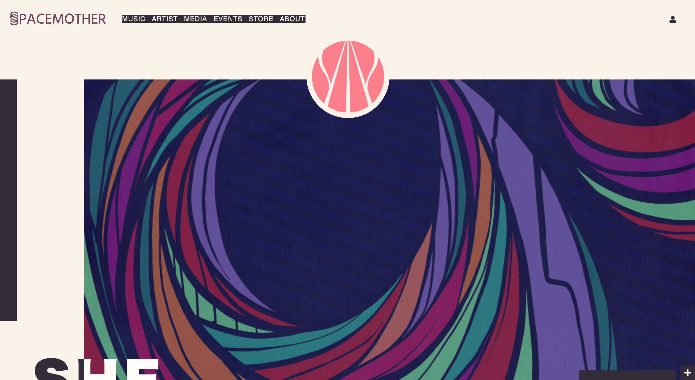
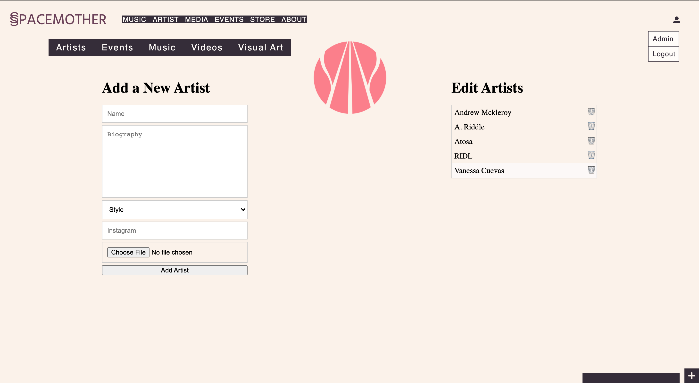
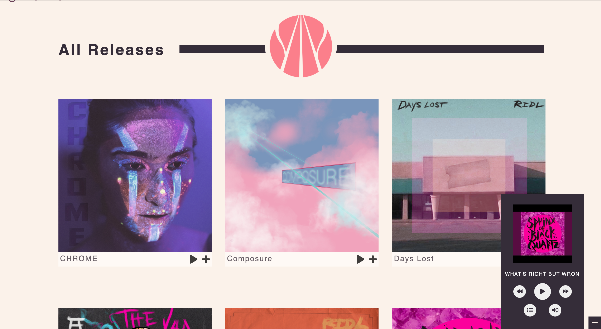
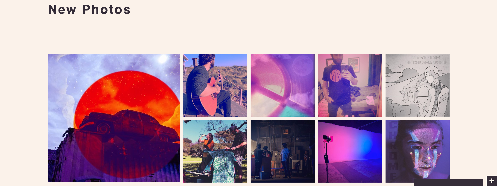

# README

# SpaceMother
Spacemother is a website made for the artistist collective of the same name. This app allows the input and management of artists, music, videos, and visual art, as well as connecting with youtube and instagram to create a hub of information and media about the collectives atists and art.

### Live Link
https://sunday-monday.herokuapp.com/

### Technologies
- PostgreSQL
- Ruby
- Ruby on Rails
- JavaScript
- React
- CSS

### Features
- Stores information about artists, music, videos, and visual art. Spacemother querys and returns this information differently depending on the user's location within the website. There is also an admin page which allows an admin to easily add, update, and delete content. Spacemother then automatically updates the website.

- A fully functional and persistent music player. Upon loading, it pulls a predetermined playlist which a user can choose to play. As a user navigates around the website, they also have the ability to play or add songs to a queue. The music player also has built in logic to start and stop at appropriate times, such as stopping when a video is played.

- Connects with the Youtube Data Api and Instagram Display Api, to create a hub for content for each artist which requires minimal work to set up.

#### Future Features
- An events page, which was delayed due to covid, which will work with the Google Maps Api, will also be included.
- A mailing list.
- Live Streaming.
- A design for different shaped screen sizes.
